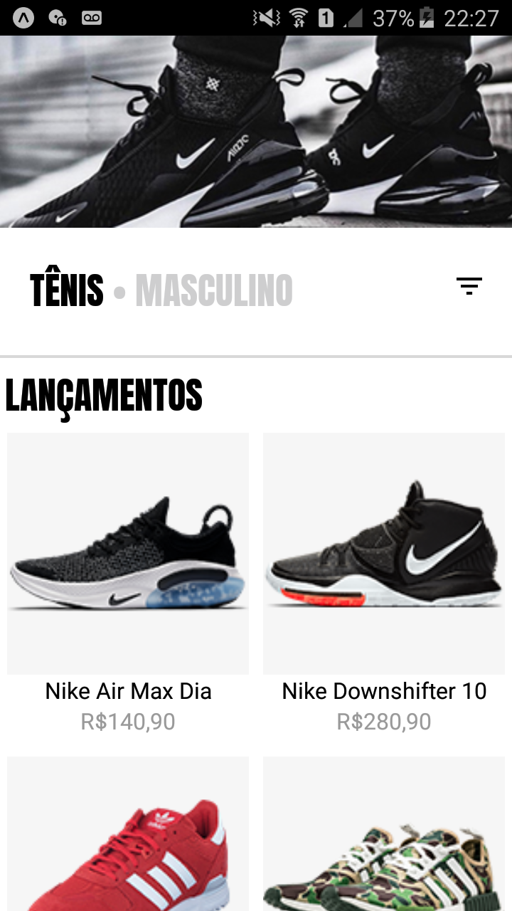

# Interface Loja
 Aplicação desenvolvida seguindo vídeo do canal Sujeito Programador. Interface de loja online com React Native.

 

  
  
  

## Requisitos
    Instalar o Git
    https://git-scm.com/downloads

    Instalar o NodeJs
    https://nodejs.org/en/

    Installar o Expo CLI
    https://docs.expo.io/get-started/installation/

## Primeiro passo - baixar o projeto
Faça download do repositório acima ou use o seguinte comando na pasta onde deseja baixar o projeto:
 - git clone https://github.com/AloisioFernandes/react-native-0-app.git

## Segundo passo - instalar dependências
Digite o seguinte comando dentro da pasta mytenis através do terminal:
 - npm install

## Terceiro passo - iniciar app
Dentro da pasta mytenis, digite o seguinte comando no terminal: 
 - expo start

Ao executar esse comando, uma página abrirá no seu navegador web. Utilize o aplicativo do expo para abrir o app através do QRCode da página.

# Tecnologias
 - <a href="https://expo.io/" target="_blank">Expo</a>
 - <a href="https://reactnative.dev/" target="_blank">React Native</a>
